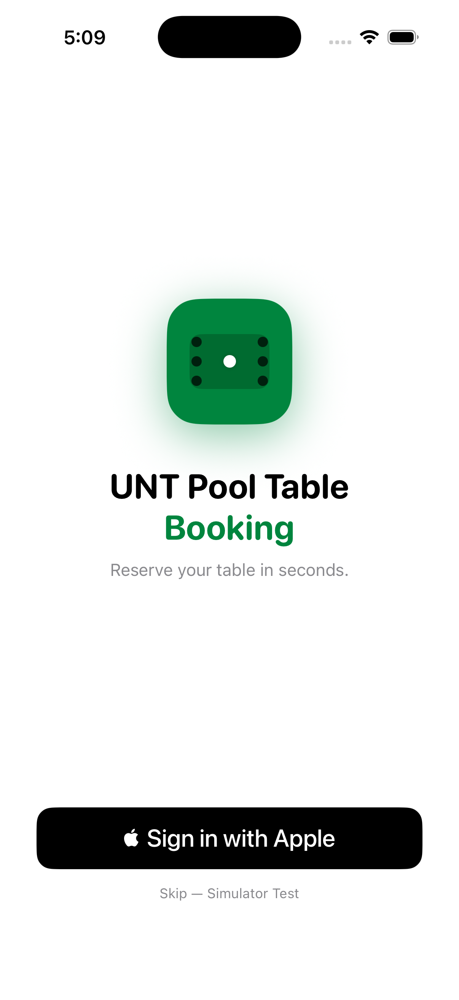
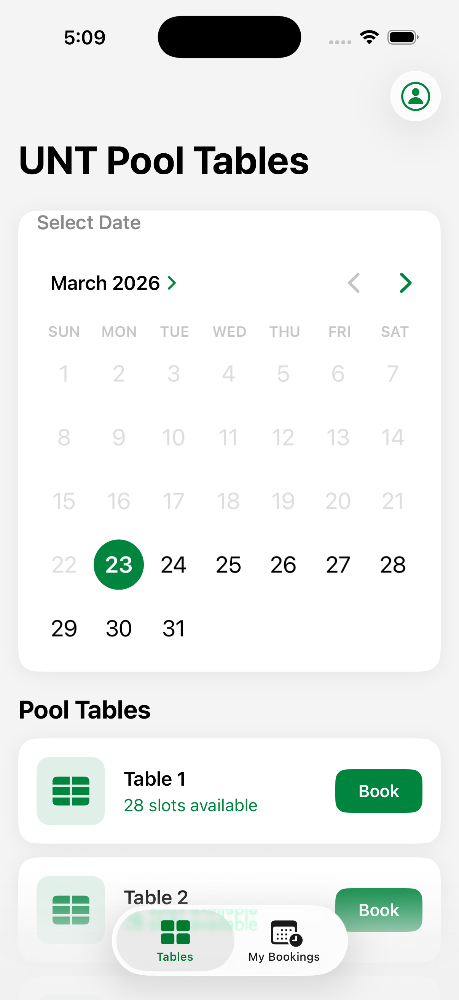
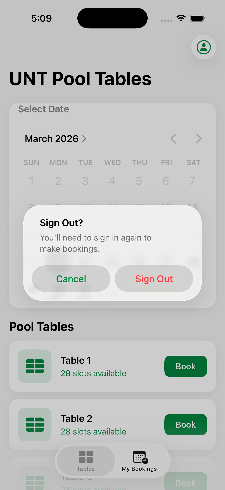
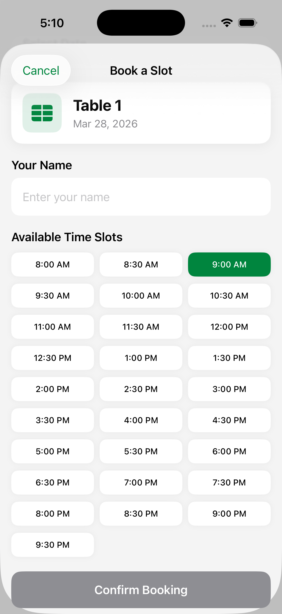

# UNT Pool Table Booking

An iOS app that lets University of North Texas students reserve pool tables at the UNT recreation center. Built with SwiftUI and Sign In with Apple.

---

## Screenshots

<p align="center">
  
  
  
  
</p>

---

## Features

- **Sign In with Apple** — secure, privacy-first authentication with credential state persistence across launches
- **Table availability** — 3 pool tables, each with real-time slot availability shown in color (green / orange / red)
- **Date picker** — graphical calendar to select any future date
- **30-minute time slots** — 28 slots per day from 8:00 AM to 9:30 PM
- **Conflict prevention** — already-booked slots are hidden from the booking sheet
- **My Bookings tab** — view all upcoming reservations sorted by date, swipe to delete
- **Confirmation screen** — summary card after every successful booking
- **Sign out** — confirmation alert before clearing the session

---

## Tech Stack

| Layer | Details |
|---|---|
| Language | Swift 5.9 |
| UI | SwiftUI |
| Auth | AuthenticationServices (Sign In with Apple) |
| Crypto | CryptoKit (SHA-256 nonce) |
| State | `@Observable` + `ObservableObject` |
| Persistence | `UserDefaults` (credentials + bookings) |
| Min Target | iOS 17 |

---

## Project Structure

```
PoolTableBooking/
├── PoolTableBookingApp.swift      # App entry point, AuthViewModel injection
├── ContentView.swift              # Root: auth gate → TabView
├── Models/
│   └── Booking.swift              # Booking model + BookingManager
├── ViewModels/
│   └── AuthViewModel.swift        # Sign In with Apple logic
└── Views/
    ├── AuthView.swift             # Sign-in screen
    ├── HomeView.swift             # Date picker + table cards
    ├── BookingView.swift          # Time slot grid + confirm
    ├── ConfirmationView.swift     # Booking success screen
    └── MyBookingView.swift        # Bookings list
```

---

## Getting Started

1. Clone the repo and open `PoolTableBooking.xcodeproj` in Xcode.
2. Select your development team in **Signing & Capabilities**.
3. The **Sign In with Apple** capability is already added via `PoolTableBooking.entitlements`.
4. Run on a real device to use Sign In with Apple, or use the **"Skip — Simulator Test"** button in the simulator.

---

## How It Works

```
App Launch
  └─ checkExistingCredential()
       ├─ Authorized  → restore session from UserDefaults
       └─ Revoked / Not Found → sign out

Sign In with Apple
  └─ configureRequest() → random nonce + SHA-256
  └─ handleCompletion() → save userID, name, email to UserDefaults

Booking Flow
  HomeView → select date → tap Book
    └─ BookingView → pick name + time slot → Confirm Booking
         └─ BookingManager.addBooking() → persist to UserDefaults
              └─ ConfirmationView → Done → dismiss sheets
```

---

## Author

Built by Shilp Patel · University of North Texas · March 2026
